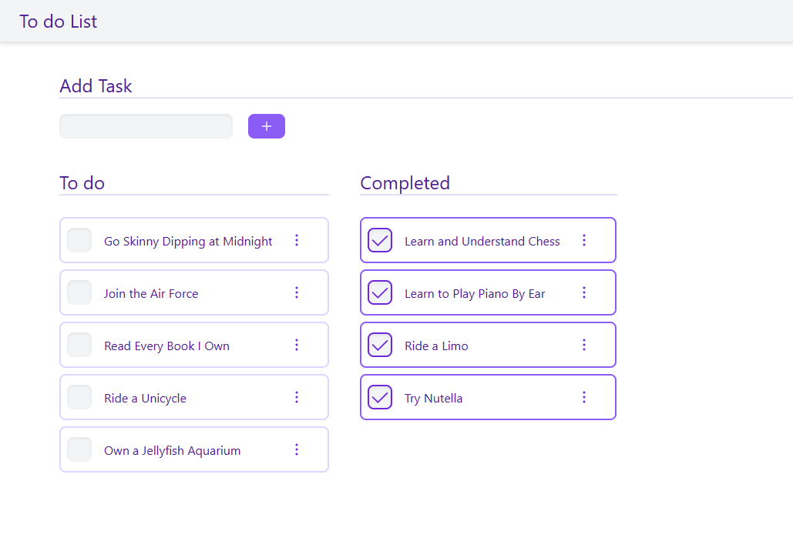
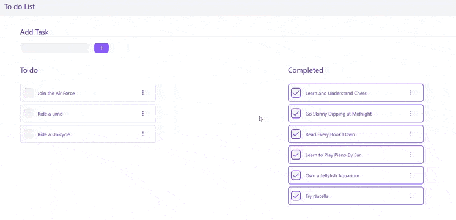

# To do List App

A To do List App with basic CRUD functionality.

### Backend
Developed with [NodeJS](https://nodejs.org/en/) and [Mongoose](https://mongoosejs.com/docs/guide.html)

### Frontend
The frontend was build with [Create React App](https://github.com/facebook/create-react-app) and [Tailwind CSS](https://tailwindcss.com/) framework

## Run Project Locally

You should have NodeJS and Mongo DB Installed Locally
### MongoDB
To start db server run the following comand in /bin folder of MongoDB instalation:

 `mongod.exe`

### Backend

To install required dependencies run the following command in the project directory:

`npm install`

and to start the server:

`npm start`

### Frontend

To install required dependencies run the following command in the project directory:

`npm install`

and to start the server:

`npm start`

Once you have started MongoDB, NodeJs and React, open [http://localhost:3000](http://localhost:3000) to view it in the browser.
The page will reload if you make edits.

